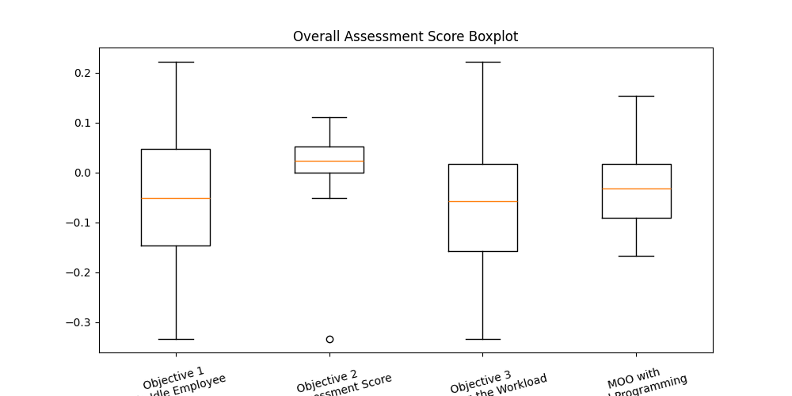

# optimization-internship

[](https://huggingface.co/spaces/YOUR_HF_USERNAME/optimization-internship)
[](https://github.com/YOUR_GITHUB_USERNAME/optimization-internship/actions/workflows/ci.yml)

Optimization projects built by the **TK Bunga Matahari** team during our internship: three warm-up
challenges and one main project, a multi-objective Scrum task-assignment model solved with Gurobi.
Everything runs from one command-line tool, `optim`, locally or in Docker, and from an
**[interactive web demo](https://huggingface.co/spaces/YOUR_HF_USERNAME/optimization-internship)**
where you can change the inputs and re-solve the models live.



| Command | Project | Technique | Solver |
| --- | --- | --- | --- |
| `optim course-selection` | [Challenge 1: Course selection](projects/course_selection/) | Binary IP, single and weighted multi-objective | OR-Tools CP-SAT |
| `optim stock-selection` | [Challenge 2: Stock selection](projects/stock_selection/) | Mixed-integer quadratically constrained program | Gurobi |
| `optim burrito-game` | [Burrito Optimization Game](projects/burrito_game/) | Facility location | OR-Tools CP-SAT |
| `optim task-assignment` | [Project 1: Scrum task assignment](projects/task_assignment/) | MIP, multi-objective with goal programming | Gurobi |

## Quick start

### With Docker

```bash
docker build -t optimization-internship .

docker run --rm optimization-internship course-selection
docker run --rm optimization-internship stock-selection
docker run --rm optimization-internship burrito-game --round zaid_r1d1
docker run --rm optimization-internship task-assignment --mini --output /tmp/out
```

To keep result files, mount a folder on `/app/outputs`. To use your Gurobi license, pass an env file:

```bash
docker run --rm --env-file .env -v "$PWD/outputs:/app/outputs" optimization-internship task-assignment
```

The image runs as a one-shot batch job, so it also works on any container job runner (Cloud Run
Jobs, AWS Batch, Kubernetes Jobs, a VM with cron).

### With Python (3.10 or newer)

```bash
python -m venv .venv
source .venv/bin/activate          # Windows: .venv\Scripts\activate
pip install -e ".[dev]"            # or: pip install -r requirements.txt && pip install -e . --no-deps

optim --help
optim course-selection
optim task-assignment --mini
```

Run commands from the repository root: the default data paths (`projects/...`) and config path
(`configs/...`) are relative to it. Every path can be overridden with an option; see
`optim <command> --help`.

### Web demo

[`app.py`](app.py) is a [Gradio](https://www.gradio.app/) app with one tab per project. It calls
the same `optim` package, so every result is solved live.

```bash
pip install -e ".[demo]"
python app.py                      # http://127.0.0.1:7860
```

The public demo uses the free size-limited Gurobi license, so it caps the task-assignment model at
2,000 variables (the mini dataset, or uploads up to roughly 10 talents x 40 tasks) and 30 seconds per
solve.

**Deploying to Hugging Face Spaces** (one-time setup; after that every push to `main` redeploys):

1. Create a free account at [huggingface.co](https://huggingface.co), then create a new Space with
   the **Gradio** SDK, named for example `optimization-internship`.
2. Create an access token with **write** permission (Settings, Access Tokens).
3. In the GitHub repository settings, under Secrets and variables, Actions:
   - add the secret `HF_TOKEN` with that token;
   - add the variable `HF_SPACE` with `your-hf-username/optimization-internship`.
4. Push to `main`. The `deploy-space` job in [`ci.yml`](.github/workflows/ci.yml) runs after the
   tests pass and uploads `app.py`, the package and the data, with
   [`deploy/huggingface/README.md`](deploy/huggingface/README.md) as the Space page.
5. Optional: in the Space settings, add the variable `REPO_URL` with the GitHub URL to show a
   source-code link in the app.

## Configuration

**Gurobi license.** `pip install gurobipy` comes with a size-limited license (2,000 variables and
constraints). That is enough for the stock-selection challenge and the task-assignment mini dataset.
The full task-assignment dataset (109 employees x 300 tasks) needs a full license, for example a free
[academic WLS license](https://www.gurobi.com/academia/academic-program-and-licenses/). Copy
`.env.example` to `.env` and fill in:

```env
WLSACCESSID=...
WLSSECRET=...
LICENSEID=...
```

`.env` is loaded automatically and is ignored by git. Other optional variables: `EMPLOYEE_PATH`,
`TASK_PATH` (task-assignment input files) and `DISCORD_URL` (progress messages).

**Solver settings.** The task-assignment model reads [`configs/task_assignment.yaml`](configs/task_assignment.yaml):
workload limit, Gurobi parameters, an optional time limit, goal-programming weights, the scoring
method and Discord notifications. Pass another file with `--config`.

## Repository layout

```text
optimization-internship/
├── src/optimization_internship/     # the installable package and `optim` CLI
│   ├── cli.py
│   ├── course_selection.py
│   ├── stock_selection.py
│   ├── burrito_game.py
│   ├── gurobi.py                    # license / environment setup
│   └── task_assignment/             # data, scoring, model, reporting, pipeline
├── projects/                        # per-project docs, data, notebooks and sample results
├── configs/task_assignment.yaml
├── app.py                           # Gradio web demo
├── deploy/huggingface/README.md     # Hugging Face Space page
├── .github/workflows/ci.yml         # tests, Docker smoke test, Space deployment
├── tests/
├── archive/                         # earlier experiments, kept for reference (see archive/README.md)
├── Dockerfile
├── pyproject.toml
└── requirements.txt                 # pinned versions used by the Docker image
```

The notebooks in `projects/` are the original exploration notebooks from Google Colab and are kept
with their outputs for reference. The maintained implementation is the `optim` package.

## Development

```bash
pip install -e ".[dev,demo]"
pytest
ruff check . && ruff format --check .
```

The task-assignment tests run on the mini dataset, so they work with the size-limited Gurobi license.

## Authors

TK Bunga Matahari Team: N. Muafi, I.G.P. Wisnu N., F. Zaid N., Fauzi I.S., Joseph C.L., S. Alisya

Supervisors: Yusuf F., Muhajir A.H., Alva A.S.

## License

MIT, see [LICENSE](LICENSE).
